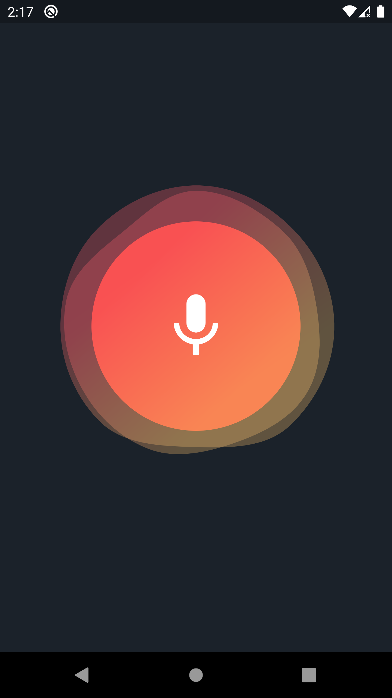
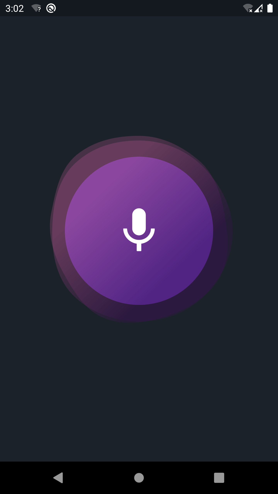

## Features

### Blob Wave Animation
This package provide a blob wave animation that can be customized to your needs. You can playing audio using **amplitude** of voice.

# Preview


## Getting started

### Installing
1. Add dependencies to `pubspec.yaml`

```dependencies
dependencies:
    wave_blob: <latest-version>
```
2. Run pub get.
```
flutter pub get
```
3. Import package
```dart
import 'package:wave_blob/wave_blob.dart';
```

## Usage

#### Simple usage

1. Wrap Widget with **WaveBlob** and assign needed parameter.
```dart
SizedBox(
    width: MediaQuery.sizeOf(context).width * 0.4,
    height: MediaQuery.sizeOf(context).width * 0.4,
    child: WaveBlob(
        child: const Icon(
            Icons.mic,
            color: Colors.white,
            size: 50.0,
        ),
    ),
),
```
<br>
> [!IMPORTANT]
> Don't forget to set **Width** and **Height** to widget.
<br>
> [!NOTE]
> Check example source code for more info.

### Customization

You can customize blob easily. You can change blob color, animation speed, min and max radius and etc. </br>
Example:
</br>
</br>
 


# Author
- **Hosein Nadalizadeh**
- [Telegram/BlobDrawable](https://github.com/DrKLO/Telegram/blob/master/TMessagesProj/src/main/java/org/telegram/ui/Components/BlobDrawable.java)

